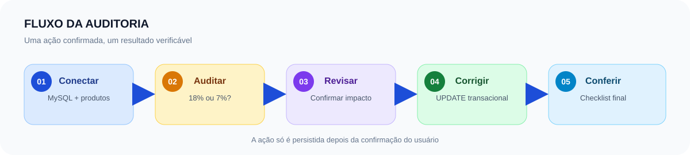

# Mini Hackathon: TechStore


> **Operação Fechamento Fiscal**
> Auditoria e correção de ICMS em uma aplicação desktop.

O TechStore é um protótipo funcional para o fechamento fiscal: conecta ao MySQL, identifica alíquotas divergentes, recalcula o ICMS e o total, solicita confirmação antes de alterar o banco e apresenta o resultado da correção.

## Em números

Na carga inicial fornecida pelo desafio, o projeto trabalha com:

| Indicador | Resultado |
|---|---:|
| Produtos cadastrados | 10 |
| Produtos com alíquota incorreta | 8 |
| Produtos que já estavam corretos | 2 |
| Impacto estimado da correção | R$ 753,38 |

O impacto representa a diferença entre o ICMS armazenado e o ICMS recalculado para os oito produtos interestaduais.

## O desafio

Na véspera do fechamento mensal, Ana, analista fiscal da TechStore, encontra uma carga de produtos com a alíquota de 18% aplicada também às vendas interestaduais. O desafio é corrigir os dados antes do fechamento, sem alterar os registros que já estavam certos.

A missão do hackathon é:

1. conectar ao banco `techstore`;
2. carregar a tabela de produtos;
3. identificar divergências na alíquota;
4. recalcular ICMS e valor total;
5. pedir confirmação do usuário;
6. persistir a correção com segurança.

## O que a implementação entrega

Além do núcleo do desafio, a implementação atual oferece uma experiência de auditoria mais completa:

- **Painel de indicadores:** total de produtos, divergências e impacto financeiro.
- **Auditoria visual:** tabela com produto, rota, valor base, alíquota, ICMS e total.
- **Correção em lote:** a ação **Corrigir ICMS** atualiza os registros divergentes em uma transação.
- **Confirmação e retorno:** a tela informa o que será alterado e só grava depois da confirmação.
- **Checklist antes/depois:** comparação do ICMS original e do ICMS recalculado após a correção.
- **Cadastro de produtos:** formulário com origem, destino, preço, cálculo automático e validação.
- **Busca e ordenação:** filtros por produto e UF, com ordenação pelas colunas da tabela.
- **Experiência de uso:** status da conexão, tooltips e atalhos de teclado.

### Escopo original x. implementação atual

O enunciado original pede uma tela, uma Treeview e o botão **Corrigir ICMS**. O código atual preserva esse fluxo central e adiciona indicadores, busca, cadastro, checklist, navegação por teclado e mensagens de estado para facilitar a demonstração e a avaliação.

A tabela principal exibe todos os produtos carregados; a quantidade de divergências fica visível no painel de indicadores. O modelo tributário é exclusivamente o modelo simplificado do hackathon, não uma simulação completa da legislação fiscal.

## Fluxo da solução



1. A aplicação conecta ao MySQL e carrega os produtos.
2. O serviço de domínio compara a rota com a regra de alíquota.
3. O painel apresenta os indicadores e a tabela.
4. O usuário escolhe **Corrigir ICMS** e confirma a operação.
5. O banco recebe a atualização transacional.
6. O checklist apresenta o ICMS antes e depois da correção.

## Regra de ICMS do desafio

| Situação da venda | Alíquota |
|---|---:|
| Mesma UF (`origem = destino`) | 18% |
| UFs diferentes (`origem ≠ destino`) | 7% |

Fórmulas usadas pelo serviço:

```text
valor_icms = valor_base × (aliquota / 100)
valor_total = valor_base + valor_icms
```

Exemplo: um produto de `SP → BA`, com base de `R$ 3.500,00`, deve usar 7% de ICMS, resultando em `R$ 245,00` de imposto e `R$ 3.745,00` de total.

Os cálculos monetários usam `Decimal` com arredondamento para duas casas decimais.

## Tecnologias

- **Python**
- **Tkinter** e `tkinter.ttk`
- **MySQL**
- **PyMySQL** para a conexão e as operações no banco
- **Decimal** para os cálculos monetários

## Arquitetura do projeto

```text
main.py
├── DB/
│   ├── conexao.py       conexão, consulta, cadastro e transações
│   └── estrutura.sql    banco, tabela e carga inicial
├── services/
│   └── icms.py          regra fiscal, cálculo e formatação
└── views/
    ├── main_window.py   painel, auditoria, KPIs e correção
    ├── cadastro_window.py  cadastro de produtos
    └── widgets.py       tooltips reutilizáveis
```

## Pré-requisitos

- Python 3 com `tkinter` disponível.
- Um servidor MySQL acessível.
- Permissão para criar e alterar o banco `techstore`.
- Cliente MySQL ou uma ferramenta para executar `DB/estrutura.sql`.

Em distribuições Linux, pode ser necessário instalar o pacote de suporte ao Tkinter fornecido pelo sistema antes de iniciar a aplicação.

## Como executar

### 1. Prepare o ambiente Python

```bash
python3 -m venv .venv
source .venv/bin/activate
python -m pip install PyMySQL==1.2.3
```

No Windows PowerShell, ative o ambiente com:

```powershell
.venv\Scripts\Activate.ps1
```

O `tkinter` pertence à biblioteca padrão do Python; ele não precisa ser substituído pelo pacote `tk` do pip.

### 2. Configure a conexão

Edite `DB/conexao.py` e informe os dados do seu ambiente MySQL em `DB_CONFIG`.

Use valores locais ou de demonstração. Não coloque senhas reais no README e não versione credenciais de produção.

### 3. Crie o banco e a carga inicial

Execute o script estrutural contra o servidor MySQL configurado:

```bash
mysql -h <host> -u <usuario> -p < DB/estrutura.sql
```

O script cria o banco `techstore`, a tabela `produtos` e os dez registros usados na demonstração.

### 4. Inicie a aplicação

```bash
python main.py
```

A janela principal deve indicar a conexão com o banco e apresentar os indicadores iniciais.

## Roteiro de demonstração

1. Abra a aplicação e confirme o status de conexão.
2. Mostre os indicadores de produtos, alíquotas incorretas e impacto.
3. Observe uma rota interestadual com 18% e uma rota interna com 18%.
4. Clique em **Corrigir ICMS** ou pressione `Ctrl+R`.
5. Leia o resumo com quantidade de registros e impacto antes de confirmar.
6. Autorize a atualização e abra o **Checklist** para comparar antes e depois.
7. Use **Cadastrar Produto** para demonstrar o cálculo automático de uma nova rota.

## Atalhos

### Tela principal

| Atalho | Ação |
|---|---|
| `Ctrl+F` ou `Ctrl+L` | Focar a busca |
| `Ctrl+R` | Corrigir ICMS |
| `Ctrl+I` | Alternar checklist |
| `Ctrl+N` | Cadastrar produto |
| `Esc` | Limpar a busca |

### Cadastro de produto

| Atalho | Ação |
|---|---|
| `Ctrl+Enter` | Cadastrar produto |
| `Ctrl+L` | Limpar formulário |
| `Ctrl+H` | Ver ajuda e regras |
| `Esc` | Fechar formulário |

## Segurança e boas práticas

- Peça confirmação antes de executar qualquer alteração no banco.
- Use sempre `WHERE id = %s` ou outro filtro específico no `UPDATE`.
- Faça um backup da tabela antes dos testes:

```sql
CREATE TABLE produtos_backup AS
SELECT * FROM produtos;
```

- Para restaurar a carga de demonstração:

```sql
TRUNCATE TABLE produtos;
INSERT INTO produtos SELECT * FROM produtos_backup;
```

- Use parâmetros SQL e mantenha `commit` e `rollback` no controle da transação.
- Não registre senhas, dados de conexão ou qualquer segredo em logs e documentação.

## Limitações conhecidas

- A alíquota é simplificada para 18% interno e 7% interestadual, conforme o desafio.
- O projeto não substitui um sistema fiscal oficial nem cobre exceções tributárias.
- A auditoria atual compara principalmente a alíquota armazenada com a alíquota esperada.
- Não há histórico permanente das alterações nem uma suíte automatizada de testes neste protótipo.

## Documentação

- [Atividade completa em Markdown](docs/Atividade_Fechamento_fiscal.md)
- [Atividade em PDF](docs/Atividade_Fechamento_fiscal.pdf)
- [Script de criação e carga do banco](DB/estrutura.sql)
- [Serviço de cálculo do ICMS](services/icms.py)
- [Janela principal](views/main_window.py)
- [Janela de cadastro](views/cadastro_window.py)

O enunciado detalhado do mini hackathon está disponível na pasta [`docs/`](docs/), enquanto [`DB/estrutura.sql`](DB/estrutura.sql) é o script canônico para preparar a base de demonstração.
